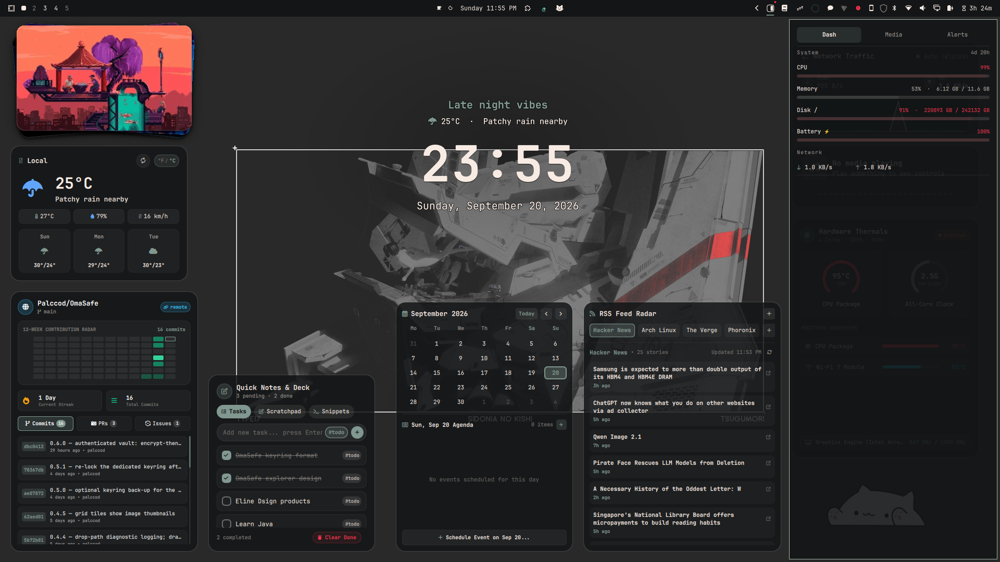

# Pdok — the side notch

A side-anchored dashboard for [Omarchy](https://omarchy.org)'s shell, inspired
by [ruixen-shell](https://github.com/gitcoder89431/ruixen-shell)'s notch —
same idea (everything in one summoned surface) but living on the **edge of
the screen** instead of dropping from the top-center: a full-height drawer
that hugs the right (or left) side below the bar.



## What's inside

| Tab | Shows |
|---|---|
| **Daily** | GIF deck on top (3D photo-stack style), a GitHub-style streak grid for your daily tasks, today's recurring tasks, a scratchpad, and todos |
| **Work** | dev.git-style GitHub dashboard: contribution heatmap, OPEN WORK counts, your open PRs, recent commits (click to copy the SHA) |
| **Media** | Now-playing with art, seekable progress, an audio output visualizer, shuffle/repeat, and a per-app volume mixer (MPRIS + PipeWire) |
| **Control** | Quick toggles (do-not-disturb, night light, stay awake, Wi-Fi, Bluetooth), output sliders (volume, brightness), network lists, and live CPU / memory / disk / network / uptime chips |

A profile footer (avatar + name) is pinned under every tab.

Details:

- **Daily tab**: the deck plays GIFs from
  `~/.local/state/omarchy/pdok/gifs/` (create it and drop files in), plus —
  read-only — the desktop-widgets photo folder when present. Click the
  right half of the card to advance, left half to go back; it auto-cycles.
  Daily tasks reset each day; checking off every task completes the day
  and feeds the GitHub-style contribution grid (green = fully done,
  translucent = partially done, ring = today; one slim column per week
  with month labels). Todos and the notes scratchpad persist as-is. All of
  it lives in `~/.local/state/omarchy/pdok-daily.json`.
- The drawer follows your theme (colors, fonts, radii, popup translucency)
  through the shell's own tokens.
- **Work tab** reuses the installed dev.git plugin's collector for the
  heatmap and open-work queues, and fetches recent commits through the
  authenticated `gh` CLI. Clicking a card opens the matching GitHub filter;
  clicking `copy` on a commit row puts its full SHA on the clipboard.
- Media routes through the first-party `omarchy.media` service when enabled
  (preferred-player logic + OSD feedback) and falls back to direct MPRIS.
  The visualizer and mixer read the default PipeWire sink and its playback
  streams directly — no polling, no external tools. Album art is only shown
  for local `file://` art — never fetched over the network from the shell
  process.
- **Control tab**: DND / night light / stay awake go through the shell's
  first-party services; Wi-Fi and Bluetooth shell out to `nmcli` and
  `bluetoothctl` with fixed argv; CPU/RAM/net are read from `/proc`, disk
  and uptime from one `df` call.

## Install

From a git clone of this repo:

```bash
omarchy plugin add https://github.com/Palccod/Pdok.git --enable
```

Or from a local folder: symlink/copy it to
`~/.config/omarchy/plugins/palccod.pdok`, then enable it from
**Omarchy settings → Bar widgets** (it lands in the right section) and
restart the shell.

## Use

- **SUPER+Z** toggles the drawer (bound in `~/.config/hypr/bindings.lua`). IPC
  toggles follow keyboard focus: with the laptop screen focused it pops there,
  with the external screen focused it pops there.
- **Click the bar button** (outlined card with a filled strip) to toggle the drawer.
- **Right-click the button** to flip the drawer between the right and left edge.
- Escape or clicking anywhere outside closes it. Tab / Shift+Tab move between
  bar widgets' panels, like any Omarchy popout.

### Choosing the GIF folder from the UI

On the Daily tab, hover the deck and click the **folder button** (bottom-right
of the card) — or, when the deck is empty, the "Choose folder…" pill. An
in-drawer browser opens: navigate with the home/up buttons and the folder
list, then **Use this folder** (or **Reset** for the default sources). The
choice is saved to the `gifDir` setting, same as the IPC command.

### Settings

Per-widget settings live in the `palccod.pdok` entry under `bar.layout` in
`~/.config/omarchy/shell.json`:

| Key | Default | Meaning |
|---|---|---|
| `side` | `right` | Which screen edge the drawer hugs (`left` or `right`) — also set by right-clicking the bar button |
| `width` | `400` | Drawer width in px (clamped 280–640) |
| `gifDir` | *(empty)* | Directory the Daily tab's GIF deck reads. Empty = `~/.local/state/omarchy/pdok/gifs` plus the desktop-widgets photos folder (when present). Set to any absolute path (`~/...` works) to read only that directory |

### IPC

```bash
omarchy-shell palccod.pdok toggle          # open/close/show/hide/toggle
omarchy-shell palccod.pdok setTab daily    # daily | dash | work | media | control (opens the drawer)
omarchy-shell palccod.pdok setSide left    # right | left
omarchy-shell palccod.pdok setGifDir ~/Pictures/gifs   # custom deck folder ("" = default)
omarchy-shell palccod.pdok pickGifDir     # open the drawer on the focused screen with the folder picker up
omarchy-shell palccod.pdok dailyAddTask "Water the plants"
omarchy-shell palccod.pdok dailyToggleTask 0   # toggle by index
omarchy-shell palccod.pdok dailyRemoveTask 0   # remove by index
omarchy-shell palccod.pdok dailySummary    # JSON: tasks, doneToday, streak, todos, gifs
omarchy-shell palccod.pdok state           # full JSON dump for scripting
```

## Uninstall

```bash
omarchy plugin remove palccod.pdok --yes
```

## License

MIT. Concept credit: ruixen-shell's `ruixen.notch`.
